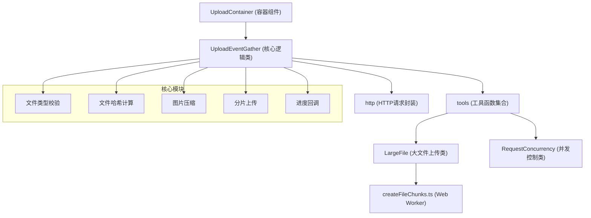

# q-upload-container 项目文档

## 项目概览

q-upload-container 是一个基于 React + TypeScript 的文件上传逻辑容器组件库。  该项目的核心理念是只提供文件上传的逻辑封装，不提供具体的UI组件，将UI的展示完全交给用户自定义实现。


## 服务端项目地址
[该项目所配合的服务端地址](https://github.com/kochey-wgq/q-upload-server)

## 快速启动
  1. **安装依赖**：
 
    npm install

  2. **开发模式运行**：

    npm run dev
 

  3. **生产环境构建**：
  
    npm run build


## 技术栈

- **框架**: React 19.0.0 + TypeScript
- **构建工具**: Vite + Rollup
- **核心依赖**: 
  - axios (HTTP请求)
  - crypto-js (文件哈希计算)
  - browser-image-compression (图片压缩)
  - antd (辅助组件)

## 项目架构



### 核心文件结构

- `src/components/UploadContainer/` - 主容器组件
- `src/utils/uploadEventGather.ts` - 核心上传逻辑处理
- `src/common/index.ts` - 工具函数和大文件上传类
- `src/api/request.ts` - HTTP请求拦截器和处理
- `src/@types/global.d.ts` - 全局类型定义
- `src/workers/createFileChunks.ts` - Web Worker文件切片处理

## 核心功能

### 1. 容器组件 (UploadContainer)  

UploadContainer 是主要的容器组件，采用 render props 模式，通过 children 函数向用户提供上传相关的方法和配置。

### 2. 核心逻辑类 (UploadEventGather) 

UploadEventGather 是核心逻辑处理类，负责：
- 文件参数处理和校验
- 小文件和大文件上传逻辑
- 图片压缩功能
- 进度回调处理

### 3. 大文件上传类 (LargeFile)

LargeFile 类提供大文件分片上传功能，包括：
- 文件分片切割
- 分片并发上传
- 断点续传
- 上传暂停/恢复
- 文件合并

### 4. 并发控制类 (RequestConcurrency)

RequestConcurrency 提供请求并发控制功能，支持：
- 最大并发数限制
- 请求队列管理
- 暂停/恢复功能

## API 参数说明

### UploadEventGatherOptions 配置 

#### requestOptions (请求配置)
- `largeUrl` - 大文件上传地址配置
  - `upload` - 分片上传地址
  - `check` - 分片查询地址  
  - `merge` - 分片合并地址
  - `second` - 秒传地址
  - `timeout` - 超时时间
- `onProgress` - 进度回调函数
- 其他 AxiosRequestConfig 配置

#### uploadOptions (上传配置)
- `accept` - 允许的文件类型
- `multipleNum` - 多文件上传数量限制
- `multiple` - 是否允许多文件上传
- `chunkSize` - 分片大小 (默认3MB)
- `maxFileUploads` - 最大文件并发上传数量
- `maxFileChunksUploads` - 最大分片并发上传数量
- `compressionOptions` - 图片压缩参数

#### 功能开关
- `toggleLargefile` - 是否启用大文件上传
- `toggleCompressionImg` - 是否启用图片压缩

### 回调函数类型

#### FileStartUploadPro 

文件开始上传的参数类型：
- `data` - 事件对象 (可以是input事件或FileList)
- `onProgress` - 上传进度回调
- `result` - 上传结果回调

#### ProgressData 

进度数据类型：
- `file` - 当前上传的文件
- `fileHash` - 文件哈希值
- `status` - 上传状态
- `percentage` - 上传进度百分比
- `progressType` - 进度类型 (upload/download)

## 核心方法

### 1. fileStartUpload - 文件上传

主要功能：
- 文件类型校验
- 文件数量校验  
- 图片压缩处理
- 大文件/小文件上传分发
- 进度回调处理

### 2. filePausedUpload - 暂停上传 

支持暂停单个文件或批量文件的上传。

### 3. getResources - 获取资源  

获取blob资源并转换为可访问的URL。

## 工具函数

### 1. 文件类型校验 (validateFiles)

支持多种文件类型规则：
- MIME类型匹配
- 文件扩展名匹配
- 通配符匹配 (如 image/*)

### 2. 文件哈希计算 (getFileHash)

使用 SHA-256 算法计算文件哈希值，作为文件唯一标识。

### 3. 图片压缩 (compressionImg) 

基于 browser-image-compression 库实现图片压缩功能。

## Web Worker 支持

### 文件切片处理 (createFileChunks.ts) 

使用 Web Worker 进行文件切片处理，避免阻塞主线程，支持：
- 文件分片切割
- 已上传分片过滤
- 断点续传支持

## HTTP 请求处理

### 请求拦截器和响应处理

提供完整的HTTP请求封装，包括：
- 请求/响应拦截器
- 上传/下载进度处理
- 错误处理
- 业务状态码配置

## 使用示例

```typescript
import UploadContainer from 'q-upload-container';

const MyUploadComponent = () => {
  return (
    <UploadContainer
      requestOptions={{
        baseURL: 'https://api.example.com',
        url: '/upload',
        method: 'post'
      }}
      uploadOptions={{
        accept: ['image/*', 'video/*'],
        multiple: true,
        multipleNum: 5,
        chunkSize: 1024 * 1024 * 3, // 3MB
        compressionOptions: { // compression插件的压缩图片参数
          maxSizeMB: 1, // 压缩图片最大大小 
          useWebWorker: true, // 是否使用web worker进行压缩
        }
      }} 
      toggleCompressionImg={true}
    >
      {({ fileStartUpload, filePausedUpload, getResources }) => (
        <div>
          <input
            type="file"
            onChange={(e) => fileStartUpload({
              data: e,
              onProgress: (progress) => console.log(progress),
              result: (result) => console.log(result)
            })}
          />
          <button onClick={() => filePausedUpload(file)}>
            暂停上传
          </button>
        </div>
      )}
    </UploadContainer>
  );
};
```

## 构建配置

项目使用 Vite 构建，支持：
- ES 和 UMD 两种输出格式
- TypeScript 类型定义生成
- 外部依赖排除 (react, react-dom)
- Source Map 生成

## Notes

该项目是一个专注于逻辑封装的文件上传组件库，具有以下特点：

1. **纯逻辑组件** - 不提供UI，完全由用户自定义界面
2. **功能完整** - 支持小文件、大文件、分片上传、断点续传等
3. **类型安全** - 完整的 TypeScript 类型定义
4. **性能优化** - Web Worker 处理文件切片，避免阻塞主线程
5. **灵活配置** - 支持多种上传模式和参数配置
6. **已发布至 NPM** - 可直接安装使用

该库特别适合需要自定义上传界面但又希望复用上传逻辑的项目场景。
